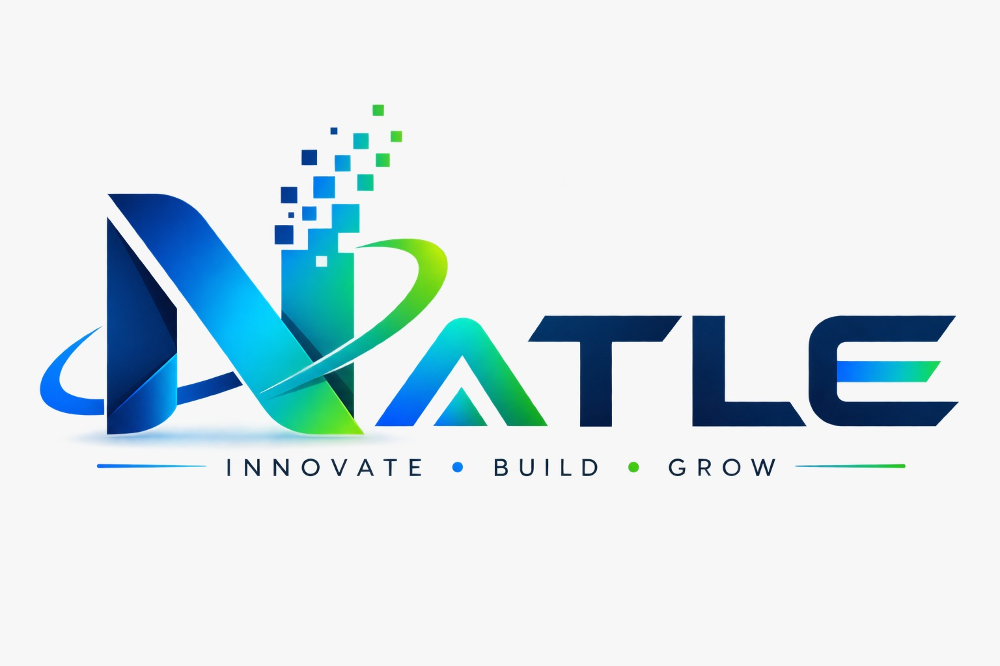

<div align="center">
  
  <h1>NATLE Studio</h1>
  <p><b>Next-Generation Software Engineering Studio</b></p>
  
  [](https://nextjs.org/)
  [](https://threejs.org/)
  [](https://gsap.com/)
  [](https://tailwindcss.com/)
  [](https://developers.cloudflare.com/turnstile/)
</div>

<br/>

## ✦ Overview

This is the core repository for **NATLE Studio's** official web platform (V2 Premium Redesign). It is engineered to reflect world-class Silicon Valley aesthetics—featuring a minimalist Pitch-Black theme, cinematic Film Grain noise, and high-performance WebGL animations.

## ✦ Technical Architecture

We prioritize extreme performance, hardware acceleration, and security.

* **Framework:** Next.js 14 (App Router)
* **Styling:** Tailwind CSS (Strictly typed with `cn` utility)
* **Typography:** Inter (Unified unified premium typeface for Display & Body)
* **3D & WebGL:** Three.js with custom GLSL Shaders (Hero Aurora & Interactive Globe)
* **Scroll Animations:** GSAP (ScrollTrigger) & Lenis (Smooth Scroll)
* **Security:** Cloudflare Turnstile (Anti-bot protection on Contact Forms)
* **Icons:** Lucide React

## ✦ Key Features

* **Cinematic Dark Theme:** Forced dark mode with SVG fractal noise overlays for a premium studio feel.
* **Hardware-Accelerated Layouts:** Horizontal GSAP execution pipelines and spotlight bento grids.
* **Magnetic Interactions:** Floating UI elements that react dynamically to cursor movement.
* **Uncompromised Security:** Form submissions protected by non-intrusive CAPTCHA.

---

## ✦ Quick Start Guide

### 1. Prerequisites
Ensure you have the following installed:
* Node.js (v18 or higher)
* Git

### 2. Installation
Clone the repository and install dependencies:
```bash
git clone https://github.com/sasiruliyanage2004/Natle-Website.git
cd Natle-Website
npm install
```

### 3. Environment Variables
Create a `.env.local` file in the root directory. You will need your Cloudflare Turnstile keys:
```env
NEXT_PUBLIC_TURNSTILE_SITE_KEY="your_cloudflare_site_key"
TURNSTILE_SECRET_KEY="your_cloudflare_secret_key"
```

### 4. Run Development Server
```bash
npm run dev
```
Open [http://localhost:3000](http://localhost:3000) in your browser to see the result.

---

## ✦ Deployment

This project is fully optimized for **Vercel**. 
1. Push the code to the `main` branch.
2. Connect the repository to Vercel.
3. Add the `.env.local` variables to the Vercel dashboard.
4. Deploy!

<br/>
<div align="center">
  <p>Engineered with precision by NATLE Studio.</p>
</div>
